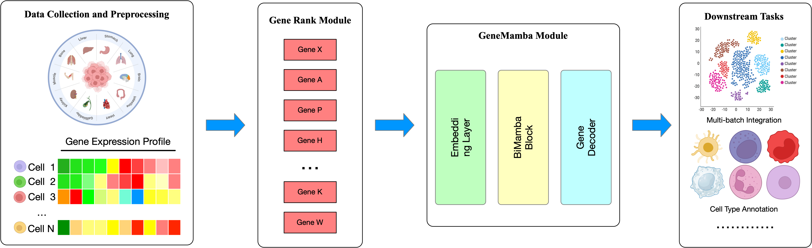
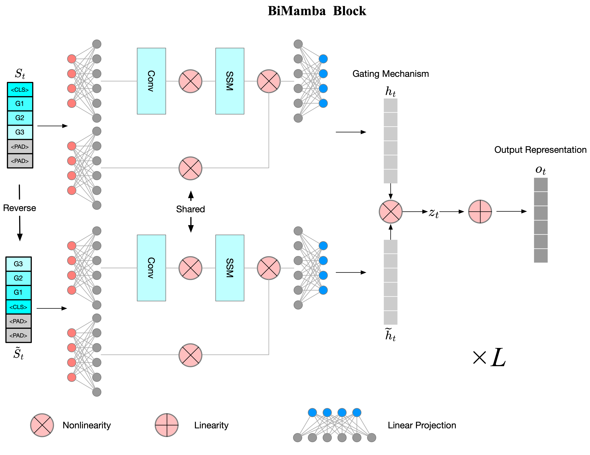

# About
In this study, we present GeneMamba, a foundational model designed to advance single-cell analysis, please see our preprint paper: 




# Installation

Install the requirements:
```bash
conda create -n "genemamba" python=3.9.19
conda activate genemamba
pip install -r requirements.txt
```

We suggest use SLURM to enable parallel computing.

Please make sure that you have nvcc installed, and the recommended version is CUDA/12.4.0

If you are using slurm, you may need

```
module load cuda/12.4.0
module load git/2.33.1
```

# Usage

For pretraining the GeneMamba model, we recommend using at least 200GB of memory and 4 GPUs to optimize the training process.

For downstream tasks, a machine with 10GB of memory and a single GPU should be sufficient.

## Pretraining


Due to the large volume of the pretraining dataset, you can

1. Manually download the datasets fby using cellxgene api;

or

2. To quickly run the experiment, download the sample dataset from the link , and put it into the datasets/pretrain/processed folder.


Then modify the model_path in the pretrain/training.sh to your local path, and run the script by

```bash
cd pretrain
./training.sh

```




## Downstream tasks

Under the example folder, there are scripts to run the downstream tasks.

First download the data from the link , and put all the datasets under the datasets/downstream folder.

Then, for each task, change the path arguments to your local path, and run the run.sh script, this will output the results all in the results folder under each task directory.


<!-- 

 -->

